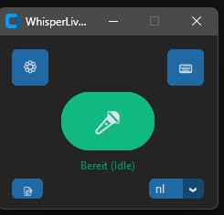

# AI-Disclaimer:
Allmost everything of this is vibe-coded. I know basic python but couldn't build such a app just by myself, so be aware that there are prob. many things that can be improved. This is why open source exists and why I am happy to post this here...


# WhisperLiveDictate

A lightweight, local real-time speech-to-text dictation desktop application powered by OpenAI's Whisper models and `faster-whisper`. Designed for fast, accurate continuous dictation with customizable context awareness, custom hotkeys, and automated post-processing error correction.

---

## 📸 Screenshots



*Main Window featuring the global toggle button, settings panel shortcut, and built-in text editor.*

---

## ✨ Key Features

- ⌨️ **Global Hotkey Toggle**:
  - Dedicated GUI button with a keyboard icon to easily enable or disable global hotkey listening.
  - When enabled, the application seamlessly intercepts custom key combinations to trigger or stop active dictation across any desktop application.
- ⚙️ **Comprehensive Audio & Model Settings**:
  - **Hardware Acceleration**: Choose between **CUDA** (GPU) and **CPU** inference modes.
  - **Quantization & Precision**: Choose between `int8`, `float16`, or `float32` depending on hardware capabilities and speed requirements.
  - **Model Selection**: Choose from built-in standard Whisper models (e.g., *tiny, base, small, medium, large-v3*) or specify a custom local path to fine-tuned Hugging Face / CTranslate2 models.
  - **Multi-Language Support**: Full support for all languages offered by Whisper (German, English, Dutch, Spanish, French, etc.).
- 🧠 **Context Window Adjustment**:
  - Fine-tune the audio context buffer duration. The engine considers the surrounding phrase context to drastically improve transcription accuracy and syntax naturalness.
- ⚡ **Writing & Output Speed Modes**:
  - Configure typing speed to suit your workflow: choose between instant character-by-character output or delayed batch processing for higher transcription fidelity.
- ✍️ **Live Punctuation & Smart Error Correction**:
  - **Live Punctuation**: Automatically insert appropriate punctuation in real-time as you speak.
  - **Auto Error Correction**: Detects and fixes minor speech errors or duplicate word slips dynamically during dictation.
- 📝 **Built-in Text Editor**:
  - Integrated quick editor window for testing dictation output, reviewing text, and modifying transcriptions on the fly without switching applications.

---

## 🛠️ Settings Breakdown

| Setting | Options / Description |
| :--- | :--- |
| **Hardware Execution** | `CUDA`, `CPU` |
| **Computation Precision** | `int8`, `float16`, `float32` |
| **Model Selection** | Pre-configured models (e.g., `tiny`, `base`, `small`, `medium`, `large-v3`) or custom local path |
| **Language Selection** | Auto-detect or select specific language (e.g., German, English, Dutch, etc.) |
| **Live Punctuation** | Toggle ON / OFF |
| **Auto Error Correction** | Toggle ON / OFF for automated text refinement during dictation |
| **Context Window** | Adjustable time buffer (in seconds) for contextual accuracy |
| **Output Speed** | Instant vs. High-Reliability Delayed mode |
| **Hotkey** | Choose your hotkey |
| **Injections-Engine** | Choose pyinput for windows and X11 - **install and use dotool for Wayland-Desktops (i.e cachy-os)**


## Languages
German, English, Dutch, Afrikaans, Albanian, Amharic, Arabic, Armenian, Assamese, Azerbaijani, Bashkir, Basque, Belarusian, Bengali, Bosnian, Breton, Bulgarian,  Cantonese, Catalan, Chinese, Croatian, Czech, Danish, Estonian, Faroese, Finnish, French, Galician, Georgian, Greek, Gujarati, HaitianCreole, Hausa,  Hawaiian, Hebrew, Hindi, Hungarian, Icelandic, Indonesian, Italian, Japanese, Javanese, Kannada, Kazakh, Khmer, Korean, Lao, Latin, Latvian, Lingala, Lithuanian, Luxembourgish, Macedonian, Malagasy, Malay, Malayalam, Maltese, Marathi, Mongolian, Myanmar, Maori, Nepali, Norwegian, Nynorsk, Occitan, Pashto, Persian, Polish, Portuguese, Punjabi, Romanian, Russian, Sanskrit, Serbian, Shona, Sindhi, Sinhala, Slovak, Slovenian, Somali, Spanish, Sundanese, Swahili, Swedish, Tagalog, Tajik, Tamil, Tatar, Telugu, Thai, Tibetan, Turkish, Turkmen, Ukrainian, Urdu, Uzbek, Vietnamese, Welsh, Yiddish, Yoruba


# Test

```python
pip install -r requirements.txt
```
dependencies:
```
paru -S dotool
sudo pacman -S portaudio
sudo pacman -S tk
```
# Build
```
PyInstaller --clean .\src\WhisperDictate.spec
```


# GPU

To run this on your graphics card, you need to install the NVIDIA CUDA Toolkit and cuDNN libraries.

## Step 1: Install the CUDA Toolkit (v12.x)
Go to the [NVIDIA CUDA Toolkit Archive](https://developer.nvidia.com/cuda-12-2-0-download-archive).

Select Windows -> x86_64 -> Windows 11 (or 10) -> exe (local).

Download and run the installer. You can just use the "Express" installation.

This will install cublas64_12.dll to your system.

## Step 2: Install cuDNN
faster-whisper also requires the Deep Neural Network library (cuDNN).

Go to the NVIDIA cuDNN Archive. (You may need to create a free NVIDIA developer account).

Download the latest [cuDNN](https://developer.nvidia.com/cudnn-archive) v8.x or v9.x that is built for CUDA 12.x (Windows zip file).

Extract the downloaded zip file.

Open the extracted folder, go into the bin folder, and copy all the .dll files inside it.

Paste those .dll files into your CUDA installation directory. By default, this is:
C:\Program Files\NVIDIA GPU Computing Toolkit\CUDA\v12.x\bin

## Step 3: Restart your PC
Windows needs to register the new system paths created by the CUDA installer. Restart your computer, change your script back to DEVICE = "cuda" and COMPUTE_TYPE = "float16", and the dictation daemon will boot up successfully on your GPU.

Heads up: If you run it after this and get an error specifically mentioning zlibwapi.dll, you will also need to download the [ZLIB DLL from NVIDIA](https://www.google.com/search?q=https://docs.nvidia.com/deeplearning/cudnn/install-guide/index.html%23install-windows) and drop it into that exact same v12.x\bin folder. (NVIDIA phased this requirement out in newer versions, but it occasionally pops up depending on the exact cuDNN version you download).